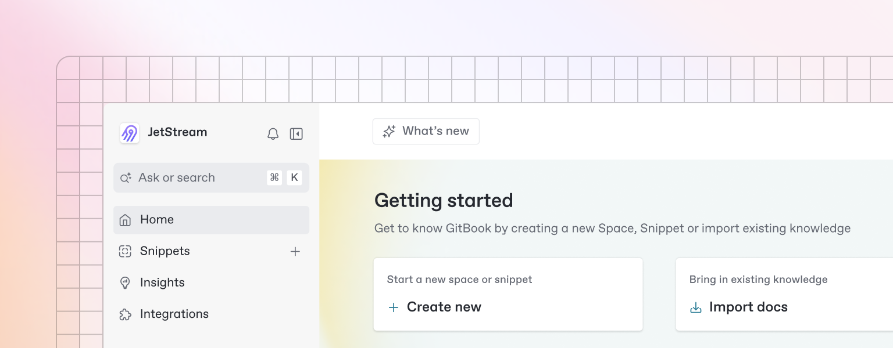

# Quickstart

<figure><figcaption></figcaption></figure>

Beautiful documentation starts with the content you create — and GitBook makes it easy to get started with any pre-existing content.

[This is a link](https://inst.gitbook.io/test/NwElCfnSTGqaE8NOHX5I/four) to page 4 via a redirect from the path 5

[This is a link](page-5.md) to page 5 which doesn't exist

[This is a link](page-3.md) to page 3 which does exist




Want to learn about writing content from scratch? Head to the [Basics](basics/editor.md) section to learn more.


### Hello World 



GitBook supports importing content from many popular writing tools and formats. If your content already exists, you can upload a file or group of files to be imported.

<figure><figcaption></figcaption></figure>

### Sync a repository 

GitBook also allows you to set up a bi-directional sync with an existing repository on GitHub or GitLab. Setting up Git Sync allows you and your team to write content in GitBook or in code, and never have to worry about your content becoming out of sync.





### Sync a repository 

GitBook also allows you to set up a bi-directional sync with an existing repository on GitHub or GitLab. Setting up Git Sync allows you and your team to write content in GitBook or in code, and never have to worry about your content becoming out of sync.

### Organization 
