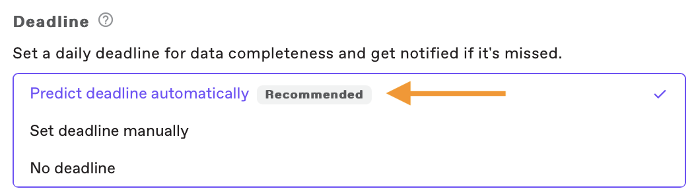

# Quickstart

Welcome to the GitBook Starter Template! Here you'll get an overview of all the amazing features GitBook offers to help you build beautiful, interactive documentation.

<figure><figcaption></figcaption></figure> <figure><figcaption></figcaption></figure>

You'll see some of the best parts of GitBook in action — and find help on how you can turn this template into your own. hi this is a change.&#x20;

<figure><figcaption></figcaption></figure>

<figure><figcaption></figcaption></figure>

<figure><figcaption></figcaption></figure>

### Jump right in now

<table data-view="cards"><thead><tr><th></th><th></th><th data-hidden data-card-cover data-type="files"></th><th data-hidden></th><th data-hidden data-card-target data-type="content-ref"></th></tr></thead><tbody><tr><td><strong>Getting Started</strong></td><td>Create your first site</td><td></td><td></td><td><a href="getting-started/quickstart.md">quickstart.md</a></td></tr><tr><td><strong>Basics</strong></td><td>Learn the basics of GitBook</td><td></td><td></td><td><a href="broken-reference/">broken-reference</a></td></tr><tr><td><strong>Publish your docs</strong></td><td>Share your docs online</td><td></td><td></td><td><a href="broken-reference">Broken link</a></td></tr></tbody></table>
