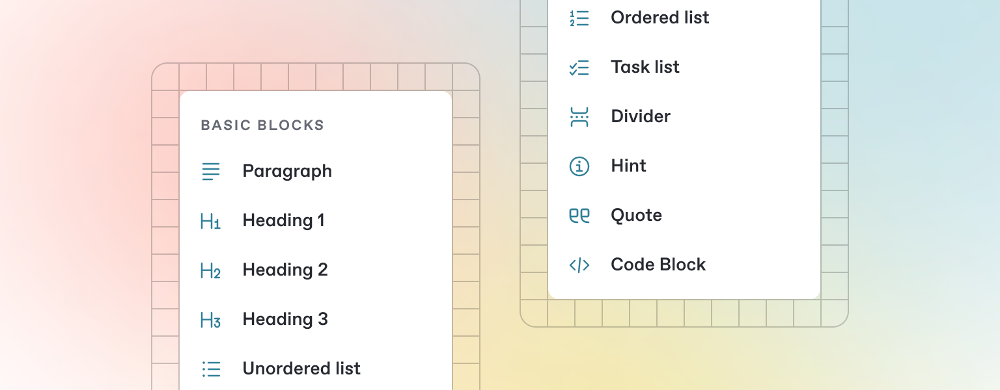

# This is a title written in GitHub

Once you’ve finished writing, editing, or importing your content, you can publish your work to the web as a docs site. Once published, your site will be accessible online only to your selected audience.

You can publish your site and find related settings from your docs site's homepage.

<figure><figcaption></figcaption></figure>

<figure><figcaption></figcaption></figure>

## Heading 1
